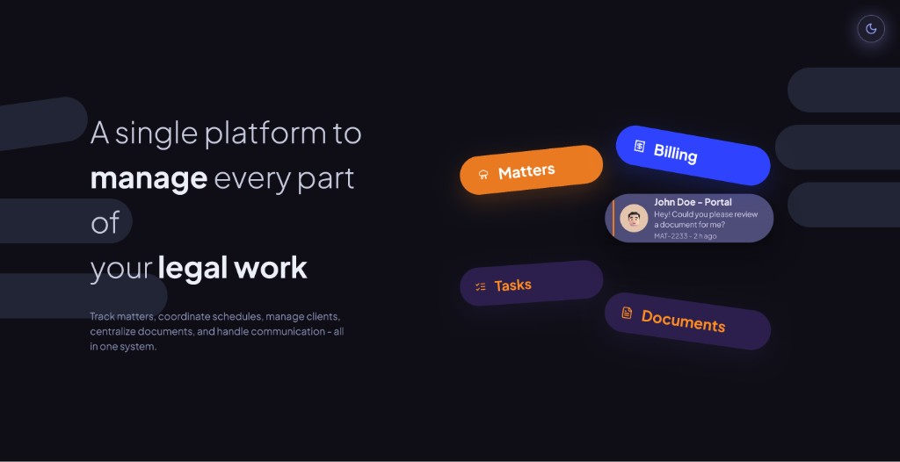
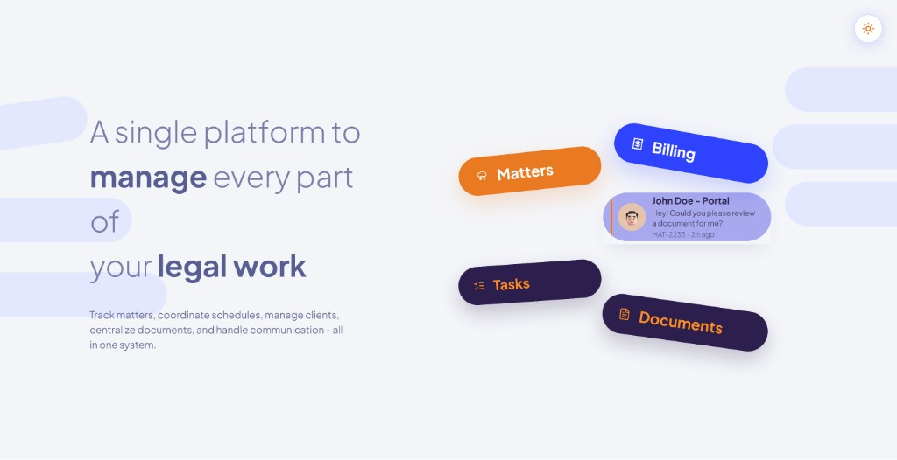

# TaskN — Legal Work Platform (Hero)

A modern marketing hero section for a legal practice management platform. Built with **Next.js 14**, **TypeScript**, **Tailwind CSS**, and **Framer Motion**.

## Preview

### Light mode



### Dark mode



## Features

- **Asymmetrical hero layout** — headline on the left, floating feature capsules on the right
- **Floating UI capsules** — Billing, Matters, Client Portal, Tasks, and Documents with subtle motion
- **Background decorative strips** — left and right pastel capsules with the first left strip tilted northeast
- **Light / dark theme** — toggle with persisted preference (`localStorage` + system default)
- **Accessible motion** — respects `prefers-reduced-motion`
- **Responsive** — adapts layout on smaller screens

## Tech stack

| Layer | Technology |
|--------|------------|
| Framework | [Next.js 14](https://nextjs.org/) (App Router) |
| Language | TypeScript |
| Styling | Tailwind CSS |
| Animation | Framer Motion |
| Icons | Lucide React |
| Font | Plus Jakarta Sans (Google Fonts) |

## Getting started

### Prerequisites

- Node.js 18+
- npm (or yarn / pnpm)

### Install and run

```bash
git clone https://github.com/Suhail7985/TaskN.git
cd TaskN
npm install
npm run dev
```

Open [http://localhost:3000](http://localhost:3000).

### Other commands

```bash
npm run build   # production build
npm run start   # run production server
npm run lint    # ESLint
```

## Project structure

```
TaskN/
├── app/
│   ├── layout.tsx          # Root layout, font, theme FOUC script
│   ├── page.tsx            # Home page → Hero
│   └── globals.css         # Base styles, theme transitions
├── components/
│   └── hero/
│       ├── Hero.tsx              # Main hero layout & card positions
│       ├── FloatingCard.tsx      # Billing, Matters, Tasks, Documents
│       ├── PortalCard.tsx        # John Doe portal notification
│       ├── BackgroundCapsules.tsx # Left/right background strips
│       ├── ThemeToggle.tsx       # Light/dark switch
│       └── MattersIcon.tsx       # Custom Matters icon
├── lib/
│   ├── hooks/
│   │   ├── useTheme.ts
│   │   └── useReducedMotion.ts
│   └── utils.ts
├── docs/
│   └── images/
│       ├── hero-light.png
│       └── hero-dark.png
└── tailwind.config.ts      # Design tokens (colors, dark mode)
```

## Layout notes

The floating capsules are arranged to match the reference design:

- **Billing** — above the Portal card, slightly to the right
- **Matters** — to the left of the Portal card
- **John Doe – Portal** — center anchor of the cluster
- **Tasks** — below Matters
- **Documents** — below Portal / to the right of Tasks

Positions live in `components/hero/Hero.tsx`. Background strip sizes and the left-first capsule rotation are in `components/hero/BackgroundCapsules.tsx`.

## Deploy on Vercel

1. Push the repo to GitHub.
2. Import the project at [vercel.com](https://vercel.com).
3. Framework preset: **Next.js** (defaults are fine).
4. Deploy.

```bash
npx vercel --prod
```

## License

Private project — all rights reserved unless otherwise specified.
